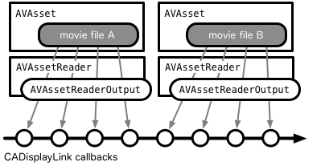

# HKLAVGaplessPlayer

[](http://choosealicense.com/licenses/bsd-3-clause/)
[](https://github.com/Carthage/Carthage/)
[](https://gitter.im/katokichisoft/SimpleGaplessPlayer?utm_source=badge&utm_medium=badge&utm_campaign=pr-badge&utm_content=badge)

HKLAVGaplessPlayer is similar Movie player class to AVQueuePlayer. But it can play multiple assets without gap.

## Requirements

iOS 8.0 or later.

## Installation

### Carthage

HKLAVGaplessPlayer is available through [Carthage](https://github.com/Carthage/Carthage). To install
it, simply add the following line to your Cartfile:

```
github "katokichisoft/SimpleGaplessPlayer" ~> 0.1.1
```

## What is this?

As you know, AVQueuePlayer is used to play a number of items in sequence. But the short gap that we can easily notice them is laid between movies. HKLAVGaplessPlayer plays them with no gap between assets.

The sample app loads video assets from camera-roll (via Photos.framework) when it is launched. Double tap the screen, it plays them with no gap.

This project includes HKLGLPixelBufferView class. It is a subclass of UIView so that you can display video frames.

## Usage

```swift
// Most simple case.

let player = HKLAVGaplessPlayer()
// append assets.
for asset in assets {
  player.appendAsset(asset)
}

// connect playerView(=HKLGLPixelBufferView) to player.
player.delegate = playerView as? HKLAVGaplessPlayerDelegate

// start playing.
player.play()
```

## How to remove gaps?

See ViewController.swift. It creates AVAssetReaderVideoCompositionOutput, which is a subclass of AVAssetReader, enables you to read each frames based on the video composition settings.

To play movies continuously, it creates AVAssetReader for each movie. and it generates a frame in each CADisplayLink callback.  Since Current devices' spec is so high, it is enough to play frames on real-time.



However, only generating frames is not good for the gapless player. Because the displaylink callback timing and a framerate of the movie is different. So I use AVAssetReaderVideoCompositionOutput & AVMutableVideoComposition instead of AVAssetReader. They enable us to set output frame interval as we like.


This is the way how to remove gaps.

## Current Limitation

HKLAVGaplessPlayer currently supports only video tracks. Audio is not supported yet.(TODO)

## License
SimpleGaplessPlayer is published under New BSD License

    Copyright (c) 2014, Hirohito Kato
    All rights reserved.
    
    Redistribution and use in source and binary forms, with or without
    modification, are permitted provided that the following conditions are met:
    
    * Redistributions of source code must retain the above copyright notice, this
      list of conditions and the following disclaimer.
    
    * Redistributions in binary form must reproduce the above copyright notice,
      this list of conditions and the following disclaimer in the documentation
      and/or other materials provided with the distribution.
    
    * Neither the name of SimpleGaplessPlayer nor the names of its
      contributors may be used to endorse or promote products derived from
      this software without specific prior written permission.
    
    THIS SOFTWARE IS PROVIDED BY THE COPYRIGHT HOLDERS AND CONTRIBUTORS "AS IS"
    AND ANY EXPRESS OR IMPLIED WARRANTIES, INCLUDING, BUT NOT LIMITED TO, THE
    IMPLIED WARRANTIES OF MERCHANTABILITY AND FITNESS FOR A PARTICULAR PURPOSE ARE
    DISCLAIMED. IN NO EVENT SHALL THE COPYRIGHT HOLDER OR CONTRIBUTORS BE LIABLE
    FOR ANY DIRECT, INDIRECT, INCIDENTAL, SPECIAL, EXEMPLARY, OR CONSEQUENTIAL
    DAMAGES (INCLUDING, BUT NOT LIMITED TO, PROCUREMENT OF SUBSTITUTE GOODS OR
    SERVICES; LOSS OF USE, DATA, OR PROFITS; OR BUSINESS INTERRUPTION) HOWEVER
    CAUSED AND ON ANY THEORY OF LIABILITY, WHETHER IN CONTRACT, STRICT LIABILITY,
    OR TORT (INCLUDING NEGLIGENCE OR OTHERWISE) ARISING IN ANY WAY OUT OF THE USE
    OF THIS SOFTWARE, EVEN IF ADVISED OF THE POSSIBILITY OF SUCH DAMAGE.

## Special Thanks

- [Norio Nomura](https://github.com/norio-nomura)
